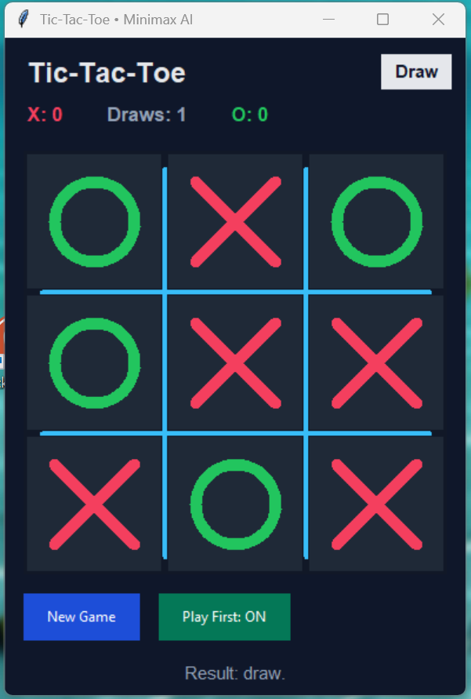

# CAP4621-2025--Team-2-Course-Project  

**Collaborators:** Emily Anderson, Jen Exum, Serena Seymour, Giovanni Bejar  

A **Tic-Tac-Toe** game with an **unbeatable AI** powered by **minimax + alpha-beta pruning**.  
The player is **‘X’**, the AI is **‘O’**.  

---

## Project Structure
#### CAP4621-2025--Team-2-Course-Project/
#### ttt_engine.py- Core game logic (board, win checks, minimax)
#### ttt_gui.py- Tkinter GUI (click-to-play, score panel, buttons)
#### test_engine.py- 17 unit tests for the engine
#### test_gui.py- 1 GUI smoke test (starts app, plays to a draw)
#### README.md- This file

## How It Works
| File | Responsibility |
|------|-----------------|
| **ttt_engine.py** | Immutable tuple board, `place`, `winner`, `is_full`, `next_player`, move ordering, **minimax with alpha-beta pruning**, `ai_best_move`. |
| **ttt_gui.py** | Tkinter canvas, click handling, visual marks (`X` red, `O` green), win-line highlight, score tracking, “New Game” / “Play First” buttons. |

---

## How to Run

### 1. Clone the repo
git clone https://github.com/serenaseymour/CAP4621-2025--Team-2-Course-Project.git
cd CAP4621-2025--Team-2-Course-Project

### 2. Run ttt_gui.py

### 3. Start a Game
Click any empty cell on the board, and an X appears. The AI will respond instantly.
Use New Game to reset, Play First to swap who starts.
